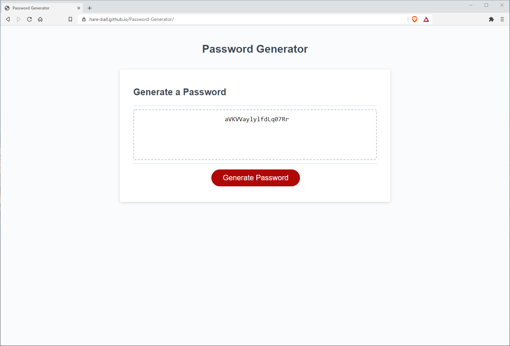

This password generator takes user input in the form of prompts, alerts and confirmations to generate a randomized password accoridng the criteria selected by the user. The user can select between upper case and lower case letters, numbers, and special characters for their password combination. The generator then randomly chooses between those selected items to create a random password of the desired length.
 
 
